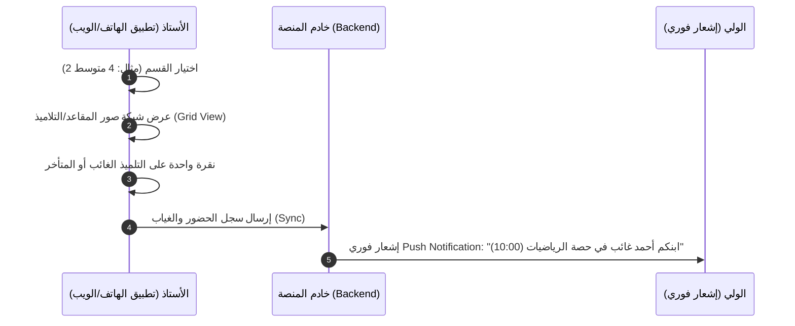
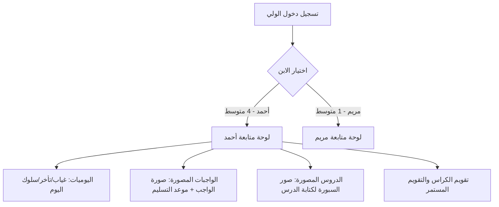

# 02. تحليل الاحتياجات وتدفقات العمل التفصيلية (Needs Assessment & Detailed Workflows)

---

## 1. تحليل احتياجات أستاذ الرياضيات في التعليم المتوسط

### أ. سياق العمل الميداني:
أستاذ الرياضيات في التعليم المتوسط (السنوات 1، 2، 3، 4 متوسط) يواجه تحديات خاصة:
1. **كثافة البرامج والحصص:** 4 إلى 5 حصص أسبوعياً لكل قسم، مع أقسام ذات تعداد يصل لـ 35-40 تلميذاً.
2. **أهمية الاستمرارية والتسلسل:** الرياضيات مادة تراكمية؛ غياب تلميذ عن حصة الحساب الحرفي أو الهندسة أو الدوال يؤثر مباشرة على تحصيله في الحصص التالية.
3. **مشكلة عدم كتابة الدرس واستعارة الكراريس:** غياب التلميذ أو بطء كتابته يدعوه لاستعارة كراس زميله، مما يتسبب في ضياع الكراريس، وتأخر التلميذين في إنجاز الواجبات.
4. **عبء دفتر المتابعة الورقي:** يستغرق الرصد الورقي التقليدي (الغياب، التأخر، الأدوات، الواجب، علامة الكراس) وقتاً ثميناً من وقت الحصة الديداكتيكي.

---

## 2. سيناريوهات العمل اليومية (Daily User Workflows)

### السيناريو الأول: بداية الحصة (الرصد الفوري للغياب والتأخر) - [المدى الزمني: 30 إلى 45 ثانية]

---

### السيناريو الثاني: نهاية الحصة (رفع الدرس المصور والواجب المصور) - [المدى الزمني: 60 ثانية]
1. الأستاذ ينقر على **"إضافة حصة جديدة"**.
2. **تصوير ملخص السبورة:** التقاط 1 إلى 3 صور لسبورة الدرس أو الأنشطة المكتوبة.
3. **تصوير الواجب:** التقاط صورة رقم التمارين أو المسألة المكتوبة على السبورة.
4. **تحديد تاريخ التسليم:** اختيار موعد الحصة القادمة (مثلاً: غداً أو يوم الأحد).
5. **النشر التلقائي:** يتم ضغط الصور ورفعها وتصل مباشرة لصفحة التلميذ والولي مع تنبيه: *"واجب منزلي جديد في الرياضيات يطلب تسليمه غداً"*.

---

### السيناريو الثالث: مراجعة وتقويم الكراس (علامة الكراس اليومية/الدورية)
* **المشكلة:** يكتب التلميذ الدرس في المنزل انطلاقاً من صور السبورة المنشورة دون الحاجة لاستعارة كراس زميله.
* **التقويم:** عند تفقد الأستاذ للكراريس، يحدد حالة الكراس بنقرة واحدة:
  * 🟢 **مكتمل ومنظم** (+1 نقطة / 20/20)
  * 🟡 **ناقص دروس** (تم تحديد الدروس الناقصة وإرسال إشعار للولي للتدارك)
  * 🔴 **غير مكتمل / مهمل** (تنبيه فوري لولي الأمر واستدعاء آلي في حال التكرار)

---

### السيناريو الرابع: تجربة ولي الأمر (حساب الولي التفاعلي)

---

## 3. تفصيل الاحتياجات حسب كل طرف (Stakeholder Requirements)

### 1. احتياجات الأستاذ (Teacher Needs):
* **سرعة فائقة:** واجهات تعمل بنقرة واحدة (One-tap Actions).
* **إمكانية العمل بدون إنترنت (Offline Mode):** إدخال الغيابات والسلوكيات وحفظها محلياً، ثم مزامنتها فور توفر الشبكة.
* **نظام التجميع التلقائي لعلامة التقويم المستمر (Continuous Assessment Score Calculator):**
  $$\text{علامة التقويم المستمر} = f(\text{المشاركة}, \text{علامة الكراس}, \text{الواجبات}, \text{السلوك والانضباط})$$
* **طباعة وتقارير PDF:** إمكانية استخراج دفتر متابعة القسم بصيغة PDF قابلة للطباعة للتسليم للإدارة أو المفتش.

### 2. احتياجات الولي (Parent Needs):
* **إشعارات لحظية (Real-time Push Notifications):** معرفة غياب أو تأخر الابن فور تسجيله من الأستاذ.
* **وضوح تام للواجبات والدروس:** مشاهدة صور السبورة فائقة الوضوح لتمكين الابن من كتابة الدرس في حال غيابه أو بطئه.
* **متابعة عدة أبناء بحساب واحد:** سهولة التبديل بين الأبناء بضغطة زر واحدة دون الحاجة لتسجيل الخروج والدخول.
* **سجل الانضباط والمحظورات:** معرفة إن كان ابنه نسي إحضار الحاسبة العلمية أو الأدوات الهندسية أو لم ينجز الواجب.

### 3. احتياجات إدارة المؤسسة (School Admin Needs - عند التوسع):
* **لوحة قيادة مركزية (Central Dashboard):** متابعة نسبة الغياب العامة للمؤسسة ولكل قسم.
* **أرشيف رقمي:** الاحتفاظ بسجلات الغيابات والسلوكيات والواجبات طوال السنة الدراسية.
* **إدارة حسابات الأساتذة والأولياء والتلاميذ:** توليد وتوزيع اسم المستخدم وكلمة المرور لكل ولي وتلميذ وأستاذ.
