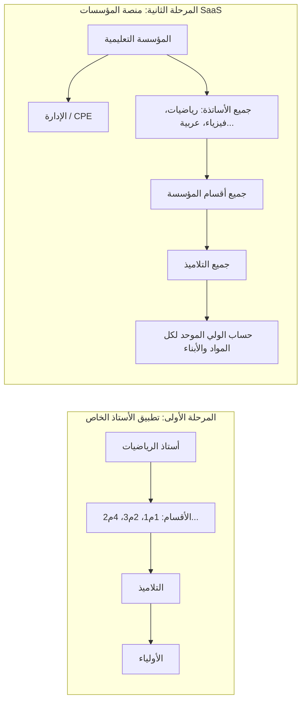

# 03. معمارية المنصة والمواصفات التقنية وقواعد البيانات (Platform Architecture & Database Design)

---

## 1. استراتيجية البناء والتوسع (Two-Phase Architecture Strategy)

تم تصميم المنصة بهيكلية مرنة ومودولية (Modular & Scalable) تتيح التشغيل الفوري على مرحلتين:

---

## 2. مخطط قواعد البيانات والكيانات (Entity-Relationship & Data Model)

تم بناء نموذج البيانات بحيث يتحول تلقائياً وبسهولة من المستوى الفردي إلى مستوى المؤسسة بدون الحاجة لإعادة كتابة الكود.

### الجداول الأساسية (Core Database Tables):

#### 1. `schools` (جدول المؤسسات - مجهز للمرحلة الثانية)
* `id` (UUID, Primary Key)
* `name` (VARCHAR): اسم المتوسطة / المؤسسة
* `academic_year` (VARCHAR): السنة الدراسية (مثال: 2026/2027)
* `created_at` (TIMESTAMP)

#### 2. `users` (جدول المستخدمين الموحد)
* `id` (UUID, Primary Key)
* `username` (VARCHAR, Unique): اسم المستخدم
* `password_hash` (VARCHAR): كلمة المرور المشفرة
* `full_name` (VARCHAR): الاسم واللقب
* `phone_number` (VARCHAR): رقم الهاتف للإشعارات
* `role` (ENUM): `'admin'`, `'teacher'`, `'parent'`, `'student'`
* `school_id` (UUID, Foreign Key -> `schools.id`, Nullable in Phase 1)

#### 3. `classes` (جدول الأقسام والمستويات)
* `id` (UUID, Primary Key)
* `name` (VARCHAR): اسم القسم (مثال: 1 متوسط 1، 4 متوسط 3)
* `grade_level` (INTEGER): المستوى (1، 2، 3، 4)
* `school_id` (UUID, Foreign Key)

#### 4. `students` (جدول التلاميذ)
* `id` (UUID, Primary Key)
* `first_name` (VARCHAR)
* `last_name` (VARCHAR)
* `roll_number` (INTEGER): رقم التلميذ في القائمة
* `class_id` (UUID, Foreign Key -> `classes.id`)
* `parent_id` (UUID, Foreign Key -> `users.id`)

#### 5. `sessions` (جدول الحصص والدروس)
* `id` (UUID, Primary Key)
* `class_id` (UUID, Foreign Key -> `classes.id`)
* `teacher_id` (UUID, Foreign Key -> `users.id`)
* `subject_name` (VARCHAR): المادة (مثال: رياضيات)
* `session_date` (DATE): تاريخ الحصة
* `title` (VARCHAR): عنوان الدرس (مثال: الحساب الحرفي - ترييب أرياظ)
* `lesson_board_photos` (JSONB / Array of URLs): روابط صور السبورة للدرس
* `created_at` (TIMESTAMP)

#### 6. `homeworks` (جدول الواجبات المنزلية المصورة)
* `id` (UUID, Primary Key)
* `session_id` (UUID, Foreign Key -> `sessions.id`)
* `description` (TEXT): تفاصيل الواجب (مثال: تمارين 12 و14 ص 35)
* `homework_photo_url` (VARCHAR): رابط صورة الواجب المصور
* `due_date` (DATE): تاريخ التسليم المطلوب
* `created_at` (TIMESTAMP)

#### 7. `attendance_logs` (جدول الحضور والغياب والتأخر)
* `id` (UUID, Primary Key)
* `session_id` (UUID, Foreign Key -> `sessions.id`)
* `student_id` (UUID, Foreign Key -> `students.id`)
* `status` (ENUM): `'present'`, `'absent_justified'`, `'absent_unjustified'`, `'late'`
* `minutes_late` (INTEGER, Optional)
* `notes` (TEXT)

#### 8. `notebook_checks` (جدول متابعة وعلامات الكراريس)
* `id` (UUID, Primary Key)
* `student_id` (UUID, Foreign Key -> `students.id`)
* `check_date` (DATE)
* `grade` (DECIMAL): علامة الكراس (مثال: 05/05 أو 20/20)
* `status` (ENUM): `'complete'`, `'incomplete'`, `'missing_lessons'`
* `teacher_feedback` (TEXT): ملاحظات الأستاذ للولي

#### 9. `student_behavior_logs` (جدول السلوك والمشاركات والنقاط)
* `id` (UUID, Primary Key)
* `session_id` (UUID, Foreign Key -> `sessions.id`)
* `student_id` (UUID, Foreign Key -> `students.id`)
* `type` (ENUM): `'positive_participation'`, `'bonus'`, `'missing_tools'`, `'missing_homework'`, `'disruption'`
* `points_delta` (INTEGER): (+1، -1، إلخ)
* `description` (TEXT)

---

## 3. استراتيجية معالجة وتخزين الصور (Media & Image Strategy)

نظراً لأن الأستاذ سيلتقط صوراً يومية للسبورة والواجبات والكراريس، تم التخطيط للتعامل الكفء مع الوسائط:

1. **الضغط التلقائي في جانب العميل (Client-side Compression):**
   قبل رفع الصورة من هاتف الأستاذ، يتم تقليل أبعادها وضغطها بواسطة مكتبات مثل (`browser-image-compression` أو Web Canvas) ليصل حجم الصورة من 5MB إلى أقل من **150KB** مع الحفاظ الكامل على وضوح أرقام ورموز الرياضيات.

2. **التخزين السحابي وشبكة التوصيل (Cloud Storage & CDN):**
   استخدام خوادم تخزين مثل Supabase Storage أو Cloudinary أو AWS S3 مع ربطها بـ CDN لضمان التنزيل السريع للصور على هواتف الأولياء حتى مع شبكات الهاتف الضئيلة (3G/4G).

3. **مستعرض الصور التفاعلي (Interactive Image Viewer):**
   واجهة الولي والتلميذ تتضمن ميزة **التكبير والتنعيم (Pinch-to-zoom & High Resolution Modal)** لتسهيل قراءة الخط المكتوب على السبورة بدقة عالية.

---

## 4. نظام الأمان وإدارة الصلاحيات (Security & RBAC)

* **التشفير وحماية الحسابات:** تشفير كلمات المرور باستخدام `Bcrypt/Argon2` وإدارة الجلسات بواسطة رموز JSON Web Tokens (JWT).
* **عزل بيانات الأولياء (Multi-tenant Data Isolation):** يضمن نظام الأمان (Row Level Security - RLS) أن الولي لا يمكنه الاطلاع إلا على بيانات أبنائه المباشرين فقط، بينما يرى الأستاذ بيانات أقسامه المحددة.
* **العمل بدون اتصال (Offline Cache & Sync):** تخزين البيانات مؤقتاً في المحفظة المحلية (IndexedDB / LocalStorage) لضمان عدم توقف الأستاذ أثناء الحصة إذا انقطعت شبكة الإنترنت بالمؤسسة.
