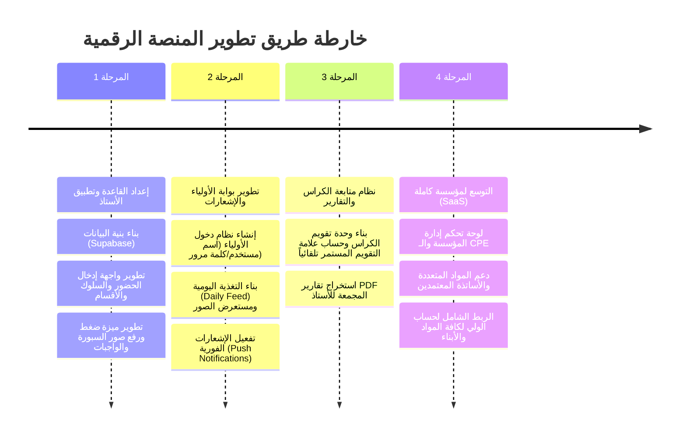

# 04. تصميم واجهات الاستخدام وخارطة الطريق للتنفيذ (UI/UX Blueprint & Implementation Roadmap)

---

## 1. فلسفة وهواية تصميم الواجهات (Design System & UX Principles)

تعتمد المنصة على نظام تصميم حديث وفاخر (Premium Modern UI) يحقق المعايير التالية:
* **Mobile-First & Ultra-Responsive:** مصمم ليعمل بسلاسة فائقة على هواتف الأستاذ والأولياء، وكذا على أجهزة الكمبيوتر واللوحات الذكية (Tablets).
* **الألوان والأيقونات المريحة للعين:**
  * الألوان الأساسية: الأزرق الملكي الداكن (Royal Blue `#1E3A8A`) والأخضر الزمردي للمؤشرات الإيجابية (`#059669`).
  * الألوان الثانوية: البرتقالي الداكن للتنبيهات والواجبات (`#D97706`) والأحمر للغياب غير المبرر (`#DC2626`).
* **الدعم الكامل للغة العربية و اتجاه النص (RTL Support):** واجهات معربة بالكامل بفيجوال وأيقونات واضحة مألوفة للمستخدم العربي والجزائري.
* **البساطة المتناهية (Minimalist & Dynamic):** تقليل عناء النقرات، واستخدام القوائم المنزلقة (Bottom Sheets) والبطاقات التفاعلية (Interactive Cards).

---

## 2. تخطيط الواجهات الرئيسية (UI Components & Screen Mockups)

### أ. واجهة الأستاذ - شاشة القسم الحالية (Teacher In-Class Dashboard)

1. **شريط اختيار القسم السريع:**
   [ 1 متوسط 1 ]  [ 2 متوسط 3 ]  [ **4 متوسط 2** ]  [ 4 متوسط 4 ]

2. **شبكة المقاعد والتلاميذ (Student Grid View):**
   * بطاقة كل تلميذ تحتوي على: صورة/رمز التلميذ + الاسم + أزرار التفاعل السريع.
   * **بنقرة واحدة على بطاقة التلميذ:**
     * نقرة قصيرة: التبديل بين ( 🟢 حاضر | 🔴 غائب | 🟡 متأخر ).
     * ضغطة مطولة (Long Press): فتح قائمة خيارات سريعة (إضافة `+` مشاركة، نسيان أدوات، نسيان واجب، علامة الكراس).

3. **الشريط السفلي المباشر (Quick Action Bar):**
   * 📷 **[ تصوير السبورة / الدرس ]**
   * 📝 **[ إضافة واجب مصور ]**
   * 📖 **[ تقويم الكراس ]**
   * 📢 **[ إرسال تنبيه للجميع ]**

---

### ب. واجهة الولي - شاشة متابعة الابن (Parent Daily Feed)

1. **مقبض التبديل بين الأبناء (Child Switcher Header):**
   * ( 👦 **أحمد** - 4 متوسط 2 )  |  ( 👧 **مريم** - 1 متوسط 1 )

2. **بطاقة ملخص اليوم (Today's Summary Card):**
   * حالة الحضور: 🟢 **حضر حصة الرياضيات (10:00 - 11:00)**
   * السلوك والمشاركة: ⭐ **+1 نقطة مشاركة ممتازة في حل المسألة**

3. **بطاقة الواجب المنزلي (Homework Card):**
   * **العنوان:** واجب الرياضيات - تمارين الحساب الحرفي
   * **صورة الواجب:** [ معاينة الصورة بوضوح عالي عند الضغط ]
   * **موعد التسليم:** غداً الساعة 08:00 صباحاً.

4. **بطاقة درس اليوم المصور (Lesson Board Photos Card):**
   * *"قام الأستاذ بنشر 2 صور لسبورة الدرس ليتمكن التلميذ من كتابتها في الكراس"*
   * [ 🖼️ صورة السبورة 1 ]   [ 🖼️ صورة السبورة 2 ]  *(مع ميزة التكبير Zoom)*

5. **سجل علامة الكراس (Copybook Rating Badge):**
   * علامة الكراس الحالية: **19/20** 🟢 (كراس مكتمل ومنظم).

---

## 3. التقديم التقني المقترح (Recommended Tech Stack)

| الطبقة | التقنية المقترحة | السبب والمميزات |
| :--- | :--- | :--- |
| **الواجهة الأمامية (Frontend)** | **Next.js / Vite (React) + PWA** | سرعة فائقة، دعم PWA للتثبيت كـ تطبيق هاتف بدون الحاجة لنشره فوراً على المتاجر، دعم كامل للـ RTL. |
| **التنسيق والواجهات (Styling)** | **Vanilla CSS / Modern CSS Modules** | أداء عالي، تحكم كامل في الألوان والتأثيرات التفاعلية والأنيميشن بدون ثقل المكتبات. |
| **قاعدة البيانات والأنظمة الخلفية (Backend & DB)** | **Supabase (PostgreSQL)** | دعم كامل لـ Auth، Row Level Security (RLS)، Storage للصور، وإشعارات حية (Realtime Subscriptions). |
| **إشعارات الهاتف (Push Notifications)** | **Web Push API / Firebase Cloud Messaging (FCM)** | إرسال تنبيهات فورية مجانية لهواتف الأولياء عند تسجيل أي غياب أو واجب جديد. |
| **ضغط الصور (Image Processing)** | **Browser Image Compression (Canvas)** | ضغط صور السبورة والواجبات تلقائياً في هاتف الأستاذ قبل رفعها لتقليل استهلاك البيانات. |

---

## 4. خارطة الطريق للتنفيذ خطوة بخطوة (Implementation Roadmap)

### الخطوات القادمة للتجربة والتطبيق:
1. البدء في إنشاء النموذج الأول الشغال (Working Prototype) المخصص لأستاذ الرياضيات.
2. تجربة رفع صور السبورة والواجبات على بيئة محاكاة واختبار سرعة الاستجابة على هواتف الأولياء.
3. التوسع التدريجي نحو إشراك باقي الأساتذة والمؤسسة التعليمية.
