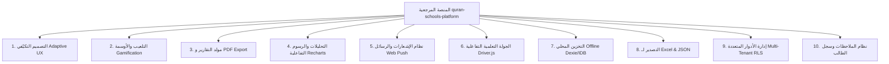

# 05. خطة التطوير الشاملة والتحول إلى منصة تكيّفية للهاتف والحاسوب (Comprehensive Platform & Adaptive Layout Plan)

---

## 1. المقدمة والأهداف من التطوير الشامل

بعد إجراء تحليل عميق للمنصة المرجعية `quran-schools-platform` واستخلاص أنماط التصميم والحلول التقنية والتربوية الممتازة فيها، تقرر تطوير تطبيق **MathTracker** من تطبيق بسيط إلى **منصة رقمية متكاملة تكيّفية (Adaptive Cross-Platform Engine)** تعمل بنفس الكفاءة والقوة على:
1. **هواتف الأندرويد والآيفون (Mobile Native Experience):** واجهة تطبيق محمول مع شريط سفلي (Bottom Nav Bar)، نوافذ منزلقة (Bottom Sheets)، إيماءات المس السريعة، وانعدام التمرير الأفقي تماماً (`0 Horizontal Overflow`).
2. **أجهزة الكمبيوتر واللوحات الذكية (Desktop & Tablet Dashboard):** شاشة لوحة قيادة كاملة مع شريط جانبي (Sidebar)، بطاقات إحصائية تفاعلية (KPI Cards)، رسوم بيانية بيانية متقدمة (Recharts)، جداول تحكم مجمعة، وتصدير التقارير بصيغة PDF و Excel.

---

## 2. الأفكار والحلول المبتكرة المستفادة من المنصة المرجعية (`quran-schools-platform`)

تمت دراسة البنية التحتية والوظائف في منصة المدارس القرآنية، وتحديد **10 محاور رئيسية** سيتم تطبيقها وتكييفها لمادة الرياضيات والتعليم المتوسط/المؤسسات التعليمية:



### التفاصيل الوظيفية لكل محور:

#### 1. التصميم التكيّفي المزدوج (Dual Adaptive Responsive Layout):
* **على الحاسوب:** شريط جانبي قابل للطي، عرض شبكي واسع (Multi-column Dashboard)، اختصارات لوحة المفاتيح (Keyboard Shortcuts)، وعرض كامل للرسوم البيانية والجداول.
* **على الهاتف:** إخفاء الشريط الجانبي وتحويله إلى شريط سفلي ثوابت (Fixed Bottom Navigation)، نوافذ منبثقة من الأسفل (Bottom Drawers)، وأزرار تفاعل بعرض مريح لللمس (Minimum 48px touch targets).

#### 2. نظام التلعيب والتحفيز والأوسمة (Gamification & Badges Engine):
* منح التلاميذ **أوسمة رقمية تفاعلية (Digital Badges)** تظهر في حساب الولي والتلميذ:
  * 🏆 **وسام عبقري الرياضيات:** للحاصلين على أعلى النقاط في المشاركة وحل المسائل المركبة.
  * 👑 **وسام الكراس الذهبي:** للتلميذ المحافظ على اكتمال ونظافة الكراس طوال الشهر.
  * 🎯 **وسام الالتزام بالواجبات:** للذين لم يفوتوا أي واجب مصور طوال الفصل.
  * ⚡ **وسام المواظبة:** للتلميذ صاحب الحضور التام بدون أي تأخر أو غياب.
* **لوحة الشرف (Leaderboard):** قائمة أوائل القسم والمستوى لرفع التنافسية الإيجابية.

#### 3. مولد التنبيهات والاستدعاءات والتقارير بصيغة PDF:
* توليد واستخراج **استدعاء ولي أمر رسمي (PDF)** مبرر بجميع الغيابات والتأخرات والواجبات غير المنجزة بنقرة واحدة (باستخدام `jspdf` و `jspdf-autotable`).
* استخراج **دفتر غياب ونقاط القسم اليومي/الأسبوعي** للتقديم للإدارة والمفتش.
* طباعة **شهادات تقدير وتشجيع آلياً** للتلاميذ المتفوقين.

#### 4. مركز التحليلات والرسوم البيانية (Interactive Analytics with Recharts):
* رسم بياني لتطور معدل القسم في الرياضيات عبر الأسابيع.
* منحنى نسبة الحضور والغياب الشهرية.
* مؤشر تتبع إنجاز الواجبات وتحديد المحاور التي يواجه فيها التلاميذ صعوبة (مثل: الحساب الحرفي، الهندسة، الدوال).

#### 5. نظام الإشعارات والإنذارات المبكرة (Smart Alerts System):
* إشعارات صوتية وبصرية لحظية عند:
  * تسجيل غياب غير مبرر.
  * تسجيل 3 مخالفات سلوكية متتالية (عدم إحضار الحاسبة أو الأدوات الهندسية).
  * نشر صورة سبورة جديدة أو واجب جديد.

#### 6. الجولة التفاعلية التعريفية (Interactive Guided Tour):
* دمج مكتبة `driver.js` لعمل جولة توجيهية خطوة بخطوة للأستاذ الجديد والولي عند أول دخول لشرح كيفية استخدام التطبيق بسهولة.

#### 7. التصدير والاستيراد (Excel / CSV Data Import & Export):
* إمكانية استيراد قائمة التلاميذ من ملف Excel (عبر مكتبة `xlsx`) لإنشاء الأقسام في ثوانٍ.
* تصدير علامات وسجلات المتابعة إلى ملفات Excel متوافقة مع أنظمة الإدارة المدرسية.

---

## 3. المعمارية التقنية والهيكلية المحدثة (Technical Architecture)

```
mathtracker/
├── src/
│   ├── app/
│   │   ├── (auth)/login/
│   │   ├── (dashboard)/
│   │   │   ├── teacher/          # لوحة الأستاذ (تكيّفية هاتف + حاسوب)
│   │   │   ├── parent/           # بوابة الولي الأبناء الجوال والحاسوب
│   │   │   ├── admin/            # لوحة الإدارة والـ CPE للمؤسسة
│   │   │   ├── analytics/        # مركز التحليلات والرسوم البيانية
│   │   │   ├── badges/           # أوسمة التحفيز ولوحة الشرف
│   │   │   └── reports/          # مولد تقارير PDF والاستدعاءات
│   │   ├── globals.css           # نظام التصميم المزدوج (Light/Dark + Adaptive Layout)
│   │   └── layout.tsx
│   ├── components/
│   │   ├── layout/
│   │   │   ├── DesktopSidebar.tsx   # الشريط الجانبي للحاسوب
│   │   │   ├── MobileBottomNav.tsx  # الشريط السفلي للهاتف
│   │   │   ├── ResponsiveHeader.tsx # الهيدر التكيّفي
│   │   │   └── ThemeToggle.tsx      # زر المظهر الفاتح/الداكن
│   │   ├── dashboard/
│   │   │   ├── KPICard.tsx          # بطاقات الإحصائيات
│   │   │   ├── AnalyticsCharts.tsx  # رسم Recharts البياني
│   │   │   ├── StudentGrid.tsx      # شبكة التلاميذ
│   │   │   └── BadgeGallery.tsx     # معرض الأوسمة
│   │   ├── modals/
│   │   │   ├── BoardPhotoModal.tsx
│   │   │   ├── HomeworkModal.tsx
│   │   │   └── PDFExportModal.tsx
│   │   └── ui/
│   ├── lib/
│   │   ├── supabase.ts
│   │   ├── imageCompression.ts
│   │   ├── pdfGenerator.ts      # محرك توليد الـ PDF
│   │   └── offlineStore.ts
```

---

## 4. خارطة الطريق للتنفيذ (Implementation Phases)

### Phase 1: إعادة إعداد التصميم التكيّفي (Adaptive Layout Engine)
- [ ] بناء نظام الهيكل التكيّفي (Desktop Sidebar + Mobile Bottom Nav).
- [ ] ضمان استجابة كاملة 100% بدون أي تمرير أفقي على الهاتف وتوسيع ممتاز على الحاسوب.

### Phase 2: دمج نظام التحليلات والأوسمة والتلعيب (Analytics & Badges Engine)
- [ ] إضافة Recharts لعرض رسوم بيانية تفاعلية لمعدلات الأقسام ونسبة الغياب والواجبات.
- [ ] بناء نظام الأوسمة التشجيعية (عبقري الرياضيات، الكراس الذهبي، التزام الواجبات).

### Phase 3: محرك التقارير وتوليد الـ PDF (Reports & PDF Engine)
- [ ] إضافة ميزة استخراج استدعاء ولي أمر رسمي بصيغة PDF.
- [ ] استخراج كشف المتابعة اليومي والشهادات التقديرية.

### Phase 4: استيراد وتصدير البيانات (Excel Import & Export)
- [ ] دعم استيراد قوائم التلاميذ من ملفات Excel.
- [ ] تصدير كشوف النقاط وسجلات الغياب إلى Excel.
