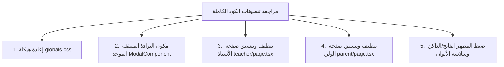

# 06. خطة المراجعة الشاملة للتنسيقات والنوافذ المنبثقة وتجربة الاستخدام (UI/UX & Modals Refactoring Plan)

---

## 1. تشخيص المشاكل التنسيقية وتجربة الاستخدام الحالية

بعد مراجعة وتدقيق الكود والتصاميم الحالية في جميع مكونات صفحة الأستاذ والولي والدخول، تم رصد النقاط التالية التي تحتاج إلى تحسين جذري:

1. **الاعتماد المفرط على التنسيقات المباشرة (Inline Styles):**
   * كثرة استخدام `style={{ ... }}` داخل مكونات JSX، مما يسبب عدم اتساق الهوامش والمسافات (Padding & Margins) بين الوضع الفاتح والداكن.
   * *الحل:* استبدال جميع التنسيقات المباشرة بكلاسات مخصصة ونظيفة في `globals.css`.

2. **طريقة ظهور النوافذ المنبثقة (Modals & Bottom Sheets):**
   * النوافذ المنبثقة (مثل نافذة تصوير السبورة، الواجب المصور، تقويم الكراس، وتكبير الصور) تحتاج إلى:
     * خلفية ضبابية عائمة (Backdrop Blur `rgba(0,0,0,0.6)`).
     * حركة ظهور سلسة من الأسفل للأعلى (Slide-Up Animation) في الهواتف.
     * تموضع ممركز ومتناسق في منتصف الشاشة (Centered Modal) في أجهزة الحاسوب واللوحات.
     * زر إغلاق واضح `✕` في أعلى اليمين مع دعم الإغلاق بالنقر خارج النافذة.

3. **اتساق بطاقات التلاميذ والتحكم اليومي (Student Cards & Attendance Flow):**
   * توحيد تصميم أزرار التحكم السريع (🟢 حاضر / 🔴 غائب / 🟡 متأخر / +⭐ مشاركة / 📄 استدعاء).
   * إضافة ألوان وتمييز بصري ساطع ومريح لكل حالة بدون تشوه البنية النصية.

4. **شريط الملاحة السفلي والجانبي (Navigation Integration):**
   * ضمان سلاسة التبديل بين التبويبات بدون إعادة تحميل الصفحات أو القفز الرأسي للنص.

---

## 2. تفاصيل خطة التعديل واستبدال التنسيقات

### أ. الهيكلة الجديدة لملف CSS الرئيسي (`globals.css`):
* **نظام المتغيرات التكيّفي (CSS Variables Refactoring):**
  * توحيد ألوان البطاقات، الحدود، النصوص، والخلفيات في الوضعين الفاتح والداكن.
* **كلاسات النوافذ المنبثقة الموحدة:**
  * `.modal-overlay`: الخلفية الضبابية الشفافة.
  * `.modal-container`: الإطار الرئيسي للنافذة المنبثقة مع تدرج حركي (`animate-slide-up`).
  * `.modal-header`, `.modal-body`, `.modal-footer`: أجزاء الهيكل المنظم للنافذة.
* **كلاسات البطاقات والنماذج:**
  * `.app-card`, `.app-input`, `.app-label`, `.badge-pill`, `.status-chip`.

### ب. مكون النافذة المنبثقة الموحد (`Modal.tsx`):
* إنشاء مكون منفصل وقابل لإعادة الاستخدام `src/components/ui/Modal.tsx` يدعم:
  * العنوان والرمز الإيقوني.
  * زر الإغلاق والخيارات.
  * التحسين البصري والحركي عند الفتح والإغلاق.

### ج. إعادة تنظيف وتدوير الكود في الصفحات:
* **صفحة الأستاذ (`teacher/page.tsx`):**
  * إزالة كافة الأسطر المحتوية على `style={{ ... }}` واستبدالها بكلاسات منظمة.
  * تحسين عرض شبكة المقاعد وتفاصيل التلاميذ.
  * تنظيم واجهات النوافذ المنبثقة لتصوير السبورة والواجب واستدعاء الأولياء.
* **صفحة الولي (`parent/page.tsx`):**
  * تنظيف تنسيقات الكروت وعرض الصور المكبرة بنقرة واحدة.
  * تحسين شريط التبديل بين الأبناء واليوميات.

---

## 3. خطة التنفيذ المباشرة

- [ ] **الخطوة 1:** إنشاء مكون النافذة المنبثقة الموحد `src/components/ui/Modal.tsx`.
- [ ] **الخطوة 2:** تحديث وتنظيف ملف `src/app/globals.css` وإضافة كافة كلاسات النوافذ والبطاقات الشاملة.
- [ ] **الخطوة 3:** إكتمال تنظيف وتنسيق صفحة الأستاذ `src/app/teacher/page.tsx` وإزالة التنسيقات المباشرة.
- [ ] **الخطوة 4:** إكتمال تنظيف وتنسيق صفحة الولي `src/app/parent/page.tsx` وإزالة التنسيقات المباشرة.
- [ ] **الخطوة 5:** إجراء بناء تجريبي `npm run build` للتأكد من خلو المشروع من أخطاء البرمجة واستقرار الواجهات.
