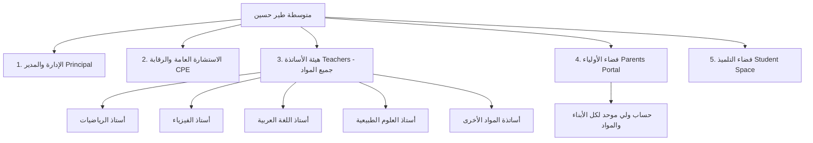

# 07. خطة تعميم المنصة لـ "متوسطة طير حسين" واعتماد الهوية البصرية كاملة (Tayyir Hocine Enterprise & Design Plan)

---

## 1. المقدمة والأهداف من التعميم والهوية الجديدة

بناءً على طلبكم الفاضل، تم إقرار خطة التحول الشاملة لمنصة **MathTracker** لتصبح المنصة الرقمية الرسمية الخاصة بـ **"متوسطة طير حسين"**، مع اعتماد **نظام التصميم والتنسيقات الكاملة من منصة المدارس القرآنية المرجعية (`quran-schools-platform`)**.

---

## 2. نظام التصميم والهوية البصرية المعتمدة (Design System)

سيتم نقل كافة التنسيقات والألوان والأزرار المعتمدة في `quran-schools-platform` مباشرة إلى مشروعنا:

### أ. الألوان والـ CSS Tokens المعتمدة:
* **اللون الرئيسي (Primary Emerald Green):** `#107a57` (الأخضر الزمردي التعليمي الرفيع) مع الدرجات `#0a5c40` و `#e6f4ee`.
* **اللون الثانوي الزمردي الذهب (Secondary Gold Accent):** `#f59e0b` (الذهبي الفاخر) مع `#d97706` و `#fef3c7`.
* **خلفية الصفحة الفاتحة:** `#fafaf7` | **خلفية الصفحة الداكنة (Dark Mode):** `#0f1117`
* **بطاقات الـ Glassmorphism:** تأثير الزجاج الشفاف الضبابي (`backdrop-filter: blur(16px)`).
* **الخطوط الرسمية:** خط `Cairo` العربي الأنيق لجميع العناوين والنصوص والأزرار.

---

## 3. المعمارية الوظيفية الشاملة لـ "متوسطة طير حسين" (Multi-Role Enterprise)

تضمن المنصة الربط والتكامل التام بين 5 أدوار رئيسية داخل المتوسطة:

### تفاصيل الأدوار والصلاحيات داخل المنصة:

#### 1. لوحة الإدارة والمدير (School Principal Dashboard):
* متابعة إحصائيات الغياب العامة للمؤسسة يومياً وأسبوعياً.
* متابعة تقدم الأساتذة في تدوين الدروس والواجبات.
* استخراج كشوف ومعدلات مجالس الأقسام وإحصائيات التسرب والغياب.

#### 2. لوحة الاستشارة العامة والرقابة (CPE / General Supervision):
* الرصد المركزي لغيابات وتأخرات تلاميذ المتوسطة بحسب كل حصة وقسم.
* **توليد وطباعة استدعاءات الأولياء الرسمية (PDF)** بختم وشعار متوسطة طير حسين.
* توثيق حضور الولي وتبرير الأعذار الطبية والرسمية.

#### 3. فضاء الأساتذة (All Subjects Teachers):
* دعم جميع المواد (رياضيات، فيزياء، لغة عربية، علوم، فرنسية، إنجليزية، تاريخ وجغرافيا...).
* لكل أستاذ أقسامه المحددة (1م1، 1م2، 2م3، 3م1، 4م2...).
* التقاط صور السبورة والدرس لكل مادة، رفع الواجبات المصورة، وتقويم الكراس اليومي.

#### 4. بوابة الأولياء الموحدة (Unified Parents Portal):
* تسجيل دخول فوري وموحد للولي لمتابعة جميع أبنائه المتمدرسين في متوسطة طير حسين.
* شريط اليوميات الموحد الذي يجمع كافة المواد (رياضيات، فيزياء، عربية...) في مكان واحد.
* معاينة صور دروس السبورة والواجبات واستقبال تنبيهات الغياب والاستدعاءات فوراً.

#### 5. فضاء التلميذ (Student Workspace):
* الاطلاع على واجبات الغد المصورة، صور السبورة لتدارك الدروس، وشارات التكريم واللوحة الشرفية.

---

## 4. خطة التنفيذ واستبدال الـ CSS وتطوير الأدوار

- [ ] **الخطوة 1:** تطبيق ملف `globals.css` الكامل المستورد من منصة المدارس القرآنية بـ متغيرات الألوان الزجاجية (`#107a57` و `#f59e0b`) وخط `Cairo`.
- [ ] **الخطوة 2:** تحديث مكون الهيدر والشريط الجانبي والسفلي ليعكس هوية **"متوسطة طير حسين"**.
- [ ] **الخطوة 3:** دعم تصفية واختيار المواد (رياضيات، فيزياء، عربية، علوم...) في لوحة الأساتذة والأولياء.
- [ ] **الخطوة 4:** إنشاء لوحة تحكم الاستشارة العامة والرقابة (CPE Dashboard) لاستخراج استدعاءات الأولياء بختم المتوسطة.
- [ ] **الخطوة 5:** إجراء اختبار بناء شامل `npm run build` للتأكد من استقرار المنصة وجمالية الواجهات.
