# 🏛️ وثيقة الهندسة الشاملة لمنصة الأستاذ الرقمية (OstadPro / منصة أستاذ الجزائر)

## 📌 1. الرؤية والهدف الاستراتيجي (Vision & Philosophy):
تحويل المنصة من مجرد أداة خاصة بمادة واحدة (الرياضيات) إلى **المنصة الوطنية الرقمية الشاملة والموحدة لجميع أساتذة التربية والتعليم في الجزائر**:
- **شاملة لجميع الأطوار:** التعليم الابتدائي، التعليم المتوسط، والتعليم الثانوي بجميع شعبه وتخصصاته.
- **شاملة لجميع المواد:** الرياضيات، العلوم الفيزيائية، علوم الطبيعة والحياة، اللغة العربية، التاريخ والجغرافيا، التربية الإسلامية، التربية المدنية، اللغة الفرنسية، اللغة الإنجليزية، الفلسفة، التكنولوجيا، والإعلام الآلي.
- **ثلاثية التكامل:** (الأستاذ 👨‍🏫 ⟷ التلميذ 🎒 ⟷ ولي الأمر 👨‍👩‍👧).
- **أقصى درجات الأمان والخصوصية:** تعمل المنصة وفق مبدأ **Offline-First / Zero-Tracking** حيث تخزن البيانات محلياً على جهاز الأستاذ مع تشفير محلي وإمكانية النسخ الاحتياطي السحابي/الملفي بنقرة واحدة (JSON).

---

## 🏗️ 2. الهيكلية المعمارية للمنصة (Universal Architecture Matrix):

```mermaid
graph TD
    A["🌟 منصة الأستاذ الرقمية (OstadPro)"] --> B["⚙️ إعدادات هوية الأستاذ والطور"]
    A --> C["👨‍🏫 لوحة تحكم الأستاذ"]
    A --> D["👨‍👩‍👧 فضاء ولي الأمر والتلميذ"]
    
    B --> B1["الطور: ابتدائي / متوسط / ثانوي"]
    B --> B2["المادة والمعامل ونظام الفروض"]
    B --> B3["الأقسام المسندة ومواقيت الحصص"]
    
    C --> C1["1️⃣ المتابعة الحية والحضور ومخطط الجلوس"]
    C --> C2["2️⃣ دفتر النصوص واستنساخ الحصص"]
    C --> C3["3️⃣ دفتر التنقيط والتقويم والملاحظات الآلية"]
    C --> C4["4️⃣ السبورة المصورة والواجبات مع الحلول المؤجلة"]
    C --> C5["5️⃣ حقيبة الوثائق الرسمية والمنهاج الوزاري"]
    C --> C6["6️⃣ إدارة سجل التلاميذ وبطاقات الأولياء PDF"]
    
    D --> D1["📌 حصة اليوم وصور السبورة والواجبات"]
    D --> D2["📊 كشف النقاط الفصلي والمعدل التقديري"]
    D --> D3["📅 مفكرة الحصص الأسبوعية"]
    D --> D4["🏆 لوحة الشرف وأوسمة التميز"]
    D --> D5["💬 تواصل واتساب بضغطة زر"]
```



---

## 🎯 3. طبقة السياق العام للأستاذ (Teacher Context & Universal Store):
لكي تصبح المنصة ديناميكية 100%، تم تأسيس نموذج البيانات العام:

```typescript
export interface UniversalTeacherProfile {
  name: string // اسم الأستاذ (مثال: أستاذ بلخيري محمد)
  school: string // المؤسسة (مثال: متوسطة الإمام الشافعي / ثانوية العقيد لطفي)
  wilaya: string // الولاية (مثال: الجزائر / وهران / سطيف...)
  stage: 'primary' | 'middle' | 'secondary' // الطور التعليمي
  stageLabel: string // 'التعليم الابتدائي' | 'التعليم المتوسط' | 'التعليم الثانوي'
  subjectId: string // معرف المادة (math, physics, science, arabic, etc.)
  subjectName: string // اسم المادة (الرياضيات، العلوم الفيزيائية، اللغة العربية...)
  academicYear: string // '2026 - 2027'
  gradingSystem: {
    testsCount: 1 | 2 // فرض واحد أو فرضان
    continuousMax: 20 // علامة التقويم المستمر
    examCoefficient: number // معامل الاختبار
    subjectCoefficient: number // معامل المادة الرسمي
  }
}
```

---

## 📱 4. مبدأ التصميم الشامل لجميع الشاشات (Universal Cross-Device Responsive Layout):
1. **الهواتف الذكية (360px إلى 480px):**
   - شريط تنقل سفلي سريع (Bottom Mobile Navigation Bar) يضم الأدوات الأكثر استخداماً في القسم: (الحضور | مخطط الجلوس | دفتر النصوص | التنقيط | الواجبات).
   - بطاقات عائمة قابلة للتمرير الأفقي والرأسي السلس مع حجم أزرار لمسية مريحة (Touch targets >= 44px).
2. **الأجهزة اللوحية (Tablets 768px إلى 1024px):**
   - تخطيط متكيف ذكي (2 Columns Grid) يستغل عرض الشاشة لعرض مخطط الجلوس أو جدول النقاط كاملاً.
3. **الحواسيب والشاشات الكبيرة (1280px إلى 1920px+):**
   - شريط جانبي متطور مع خاصية الطي السلس (Collapsed Mode) وقاعدة **عدم وجود أي شريط تمرير غير ضروري (Zero Scrollbar Rule)**.
