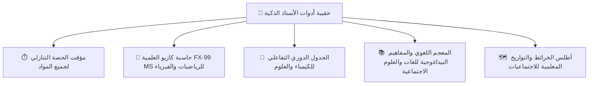

# 🚀 الخطة الاستراتيجية الشاملة لتطوير منصة الأستاذ لجميع المواد والأطوار (Master Evolution Plan)

> [!IMPORTANT]
> **الهدف:** تفكيك واجهات وميزات تطبيق الأستاذ المكتشفة في الصور (الساعة والتقويم الهجري، حكمة اليوم، حاسبة كازيو المدمجة، مخطط الجلوس، ومكتبة المذكرات)، ثم تعميمها وتطويرها لتصبح **منصة وطنية شاملة ومتكاملة** لجميع أساتذة التعليم الابتدائي، المتوسط، والثانوي في كافة المواد الدراسية.

---

## 🔍 أولاً: تحليل ما تم اكتشافه في صور التطبيق المنافس:

| العنصر في الصور | وظيفته في تطبيقهم | كيف سنطوره ونعممه لجميع المواد؟ |
| :--- | :--- | :--- |
| **1. الصفحة الرئيسية والبطاقة اليومية** | ساعة رقمية، تاريخ ميلادي وهجري، وحكمة اليوم. | سنبني **لوحة قيادة يومية تفاعلية**: تعرض الساعة الحية، التاريخ الهجري والميلادي، حكمة بيداغوجية يومية متجددة، وموجز حصص اليوم مع زر تحضير فوري. |
| **2. حاسبة كازيو العلمية (Casio FX-99 MS)** | أداة مدمجة لحساب العمليات الرياضية. | سنبني **حقيبة أدوات الأستاذ الذكية**: تضم حاسبة كازيو العلمية المتطورة (FX-99 MS)، مؤقت الحصة التنازلي (Class Timer)، والجدول الدوري التفاعلي، ومعجم المصطلحات لأساتذة اللغات والعلوم. |
| **3. مخطط جلوس الطلاب ومولد الطاولات** | تحديد عدد الصفوف والطاولات وتوليد المخطط وتصدير PDF. | سنطوره ليدعم **التوليد المخصص للشبكة** (صفوف x أعمدة) مع **التنقيط والتحضير الحي باللمس** وتصدير PDF رسمي معتمد. |
| **4. مكتبة المذكرات والوثائق** | مذكرات لسنوات الثانوي لمادة الرياضيات فقط. | سنبني **المكتبة البيداغوجية الوطنية الشاملة**: تغطي الابتدائي (1-5)، المتوسط (1-4 BEM)، والثانوي (1-3 BAC بكافة الشعب) ولجميع المواد (عربية، فيزياء، علوم، اجتماعيات، لغات...). |

---

## 🧰 ثانياً: حقيبة أدوات الأستاذ الذكية حسب المادة (Smart Teacher Toolbelt):

### 1. مؤقت الحصة التنازلي التفاعلي (Classroom Stopwatch & Timer):
- أداة حيوية لجميع الأساتذة لإدارة وقت وضعيات التعلم:
  - وضعية الانطلاق (5 إلى 10 دقائق).
  - بناء التعلمات وحل الأنشطة (35 دقيقة).
  - التقويم التكويني والواجب المنزلي (10 دقائق).
  - تنبيه صوتي وبصري أنيق عند انتهاء الوقت المخصص لنشاط الفوج.

### 2. حاسبة كازيو العلمية المدمجة (Casio Scientific FX-99 MS):
- واجهة فيزيائية تحاكي آلة كازيو الأصلية بحساب الجذور، القوى، النسب المثلثية (`sin`, `cos`, `tan`)، اللوغاريتمات، والنسب المئوية مع شاشة LCD، لتساعد الأستاذ أثناء الحصة وتصحيح الفروض دون مغادرة التطبيق.

### 3. بنك المذكرات والوثائق المفتوح لجميع الأطوار:
- تبويب مخصص في القائمة يعرض المذكرات والكتب المدرسية الرسمية لجميع المستويات:
  - **التعليم الابتدائي:** (1، 2، 3، 4، 5 ابتدائي).
  - **التعليم المتوسط:** (1، 2، 3، 4 متوسط — BEM).
  - **التعليم الثانوي:** (1، 2، 3 ثانوي بجميع الشعب: علوم، تقني، رياضيات، تسيير، آداب، لغات — BAC).

---

## 🏛️ ثالثاً: هيكلية الصفحة الرئيسية المطورة (The Master Daily Hub):

1. **البطاقة الذهبية العلوية (Header Card):**
   - الساعة الحية الدقيقة (HH:MM:SS AM/PM).
   - التاريخ الميلادي الرسمي (مثال: الإثنين 17 أوت 2026).
   - التاريخ الهجري المعتمد في الجزائر (مثال: 4 ربيع الأول 1448 هـ).
   - اقتباس وحكمة تربوية يومية للأستاذ من التراث التربوي الجزائري والعالمي.
2. **ملخص الحصص ومتابعة الأفواج:**
   - القسم الحالي والحصة القادمة مباشرة.
   - إحصائية سريعة: نسبة حضور اليوم، الواجبات المعلقة، والنجوم الممنوحة.
3. **أزرار الوصول السريع للأدوات:**
   - `[🪑 مخطط الجلوس]` • `[🧮 حاسبة كازيو]` • `[⏱️ مؤقت الحصة]` • `[📂 بنك المذكرات]` • `[📊 كشف النقاط]`.
