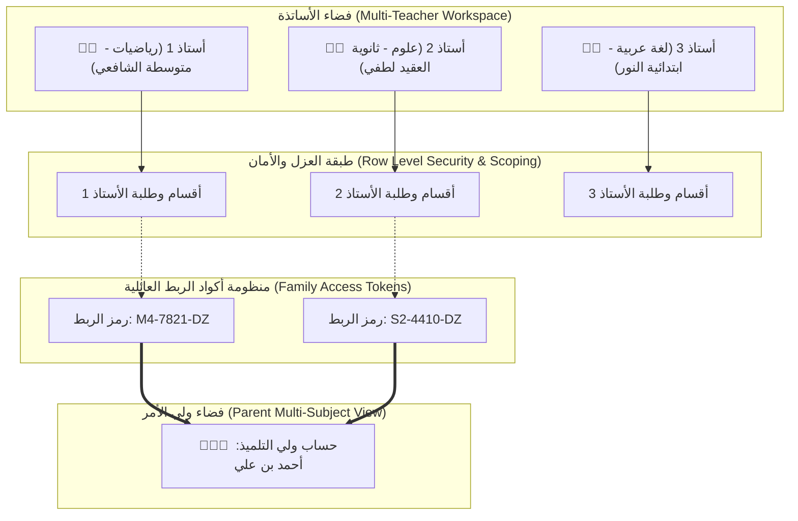
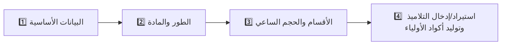
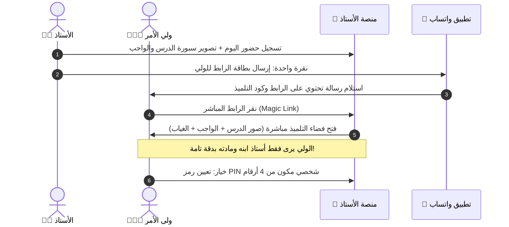

# 📋 الخطة الهندسية الشاملة: نظام الأساتذة المتعددين ومنظومة ربط حسابات الأولياء الفائقة الدقة
## (Multi-Teacher Platform & Precision Parent Linking Architecture)

---

> [!IMPORTANT]
> **الهدف الأساسي من هذه الوثيقة:**
> تحويل المنصة من نظام محلي أحادي إلى **منصة سحابية/محلية مرنة تخدم أي أستاذ في الجزائر** (في أي طور ومادة)، مع تصميم **أبسط وأدق منظومة لدعوة وربط الأولياء** تضمن عدم تداخل الحسابات بين الأساتذة، وتلائم بساطة الأولياء في الجزائر (اعتماد رمز الدخول السريع، رسائل WhatsApp المباشرة، والروابط السحرية بنقرة واحدة).

---

## 🧭 فهرس المحتويات
1. [الرؤية المعمارية وهيكلية عزل البيانات (Multi-Tenant Isolation)](#1-الرؤية-المعمارية-وهيكلية-عزل-البيانات)
2. [رحلة الأستاذ خطوة بخطوة (Teacher Onboarding Wizard)](#2-رحلة-الأستاذ-خطوة-بخطوة-teacher-onboarding-wizard)
3. [المنظومة الهندسية الفائقة لربط حساب الولي بالأستاذ (Parent-Teacher Precision Linking)](#3-المنظومة-الهندسية-الفائقة-لربط-حساب-الولي-بالأستاذ)
4. [طرق دخول الولي وسيناريوهات الاستخدام اليومية](#4-طرق-دخول-الولي-وسيناريوهات-الاستخدام-اليومية)
5. [أدوات القسم السحرية المستفادة من الدراسات العالمية والمحلية](#5-أدوات-القسم-السحرية-المستفادة-من-الدراسات-العالمية-والمحلية)
6. [مخطط قاعدة البيانات والعلاقات (Database Schema & RLS Policies)](#6-مخطط-قاعدة-البيانات-والعلاقات-database-schema)
7. [مراحل التنفيذ البرمجية (Implementation Roadmap)](#7-مراحل-التنفيذ-البرمجية)

---

## 1. الرؤية المعمارية وهيكلية عزل البيانات



### المبادئ الأساسية:
1. **عزل البيانات الصارم (Strict Multi-Tenancy):** لكل أستاذ معرّف فريد (`teacher_id`). لا يمكن لأي أستاذ الاطلاع على تلاميذ، نقاط، أو سبورات أستاذ آخر.
2. **الخصوصية أولاً (Offline-First Capability):** يمكن للأستاذ استخدام المنصة دون إنترنت محلياً، وعند الاتصال تتم المزامنة السحابية المشفرة.
3. **عدم إرهاق الولي (Zero Friction for Parents):** الأولياء في الجزائر لا يرغبون في تعقيدات إنشاء حساب عبر البريد الإلكتروني وتفعيله؛ الحل هو **رمز تلميذ عائلي فريد (Family Access Code)** ورابط مباشر عبر **WhatsApp** يُفتح بنقرة واحدة.

---

## 2. رحلة الأستاذ خطوة بخطوة (Teacher Onboarding Wizard)

عند دخول أستاذ جديد إلى المنصة، يمر بمعالج ذكي من 4 خطوات سريعة (أقل من دقيقتين):



### تفاصيل الخطوات:
- **الخطوة 1: البيانات الأساسية (Identity)**
  - الاسم واللقب (مثال: أ. زكرياء بلقاسم).
  - الولاية والبلدية (قائمة ولايات الجزائر الـ 58).
  - المؤسسة التعليمية (مثال: متوسطة الإمام الشافعي).
  - رقم الهاتف (اختياري، للنسخ الاحتياطي وإشعارات الواتساب).

- **الخطوة 2: الطور والمادة (Curriculum Scope)**
  - **الطور التعليمي:**
    - 🎒 التعليم الابتدائي (1 إلى 5 ابتدائي).
    - 📐 التعليم المتوسط (1 إلى 4 متوسط - BEM).
    - 🎓 التعليم الثانوي (1 إلى 3 ثانوي بجميع الشعب الـ 7 - BAC).
  - **المادة التعليمية:**
    - اختيار المادة من القائمة الرسمية المعتمدة لوزارة التربية الوطنية (رياضيات، علوم فيزيائية، علوم الطبيعة والحياة، لغة عربية، تاريخ وجغرافيا، إنجليزية، فرنسية، فلسفة...).
    - مع إمكانية كتابة مادة خاصة (Custom Subject).
    - تحميل المعاملات الرسمية والحجم الساعي فوراً من ملف `pedagogicalData.ts`.

- **الخطوة 3: تحديد الأقسام (Classrooms)**
  - كم قسماً يدرسه الأستاذ؟ (مثال: 3 أقسام).
  - أسماء الأقسام: (مثال: 4 متوسط 1، 4 متوسط 2، 1 متوسط 3).

- **الخطوة 4: إدخال التلاميذ (Students Entry)**
  - **الخيار أ (الأسرع والأذكى):** استيراد ملف **Excel من موقع الرقمنة الوزاري** (بضغطة زر تُستخرج الأسماء وتُسكن في الأقسام).
  - **الخيار ب:** لصق قائمة الأسماء دفعة واحدة (Paste names list).
  - **الخيار ج:** الإدخال اليدوي تلميذاً تلميذاً.

فور اكتمال هذه الخطوة: يقوم النظام **تلقائياً** بتوليد:
1. بطاقات دعوة الأولياء (PDF جاهز للطباعة بحجم A4 يحتوي على 8 قصاصات صغيرة لكل قسم).
2. رسائل واتساب جاهزة لكل ولي تحتوي على الرابط المباشر وكود الدخول.

---

## 3. المنظومة الهندسية الفائقة لربط حساب الولي بالأستاذ

### ❓ المشكلة المعقدة:
إذا سجل الأستاذ (أ) ودرّس التلميذ "أحمد"، ثم سجل الأستاذ (ب) في نفس المؤسسة أو مادة أخرى ويدرّس أيضاً "أحمد":
- كيف يفتح الولي حسابه دون أن يختلط الأمر بين الأستاذين؟
- كيف نمنع ولياً من الدخول العشوائي لحساب تلميذ آخر؟
- كيف نسهل على الولي الأمر دون كلمة مرور معقدة؟

### 💡 الحل العبقري المبتكر: "رمز التلميذ العائلي الذكي" (Smart Family Code - SFC)

```
        ┌──────────────┬──────────────────┬──────────────┐
        │  رمز المادة  │   معرّف التلميذ   │  رمز التحقق  │
        │   SUB-CODE   │    STUDENT-ID    │   CHECKSUM   │
        ├──────────────┼──────────────────┼──────────────┤
        │     M4       │      7842        │      DZ      │
        └──────────────┴──────────────────┴──────────────┘
                       الكود الظاهر للولي: M4-7842-DZ
```

#### خصائص هذا الرمز:
1. **فريد وغير قابل للتكرار (Globally Unique):** يربط بدقة متناهية ثلاثية الأبعاد:
   $$\text{Link} = (\text{Teacher ID}, \text{Class ID}, \text{Student ID})$$
2. **محمي ضد التخمين (Anti-Brute Force):** يتضمن خانة تحقق رقمية (Checksum)، وإذا أخطأ المستخدم 3 مرات متتالية يُقفل الإدخال لمدة 5 دقائق.
3. **مشفر في رابط سحري مباشر (Magic Link):**
   `https://ostadpro.dz/p?token=eyJhbGciOi...`
   الولي لا يحتاج لكتابة الكود يدوياً إذا فتح الرابط من رسالة الواتساب.

---

## 4. طرق دخول الولي وسيناريوهات الاستخدام اليومية



### السيناريوهات الواقعية وكيف يعالجها النظام:

#### 🟢 السيناريو 1: ولي بسيط ليس لديه أي خبرة تقنية
- يصله عبر واتساب رسالة من الأستاذ:
  > *"السلام عليكم ولي أمر التلميذ **أحمد بن علي**، يسر أستاذ الرياضيات أ. زكرياء دعوتكم لمتابعة كراس وواجبات ونقاط ابنكم عبر منصة الأستاذ الرقمية.*
  > *رابط الدخول المباشر:* `https://ostadpro.dz/p/M4-7842-DZ`
  > *رمز التلميذ:* `M4-7842-DZ`"
- ينقر الولي على الرابط 👈 يفتح هاتفه فضاء ابنه مباشرة دون الحاجة لكتابة اسم مستخدم أو كلمة سر معقدة!

#### 🟡 السيناريو 2: ولي لديه أكثر من ابن في المدرسة (أو في مستويات مختلفة)
- عند دخول الولي لحساب ابنه الأول (أحمد - 4 متوسط)، يجد في أعلى الشاشة زراً:
  `[➕ إضافة ابن آخر]`
- يدخل رمز التلميذ الخاص بابنته (مريم - 2 متوسط): `M2-3319-DZ`.
- النظام يقوم تلقائياً بدمج الابنين في واجهة الولي ويظهر مبدل أطفال أنيق `(أحمد 👦 / مريم 👧)` يتنقل بينهما بلمسة واحدة.

#### 🔵 السيناريو 3: نفس التلميذ يدرّسه أكثر من أستاذ مسجل في التطبيق
- أستاذ الرياضيات أرسل كوده: `MATH-7842`.
- أستاذ العلوم الفيزيائية أرسل كوده: `PHYS-7842`.
- عندما يُدخل الولي كود أستاذ الفيزياء، النظام يفهم بذكاء أن هذا لنفس التلميذ "أحمد بن علي"، فيضيف مادة الفيزياء إلى جانب الرياضيات!
- الولي يرى الآن:
  - تبويب: `📐 الرياضيات — أ. زكرياء` (سبورة اليوم، الواجب، نقاط التقويم).
  - تبويب: `🧪 العلوم الفيزيائية — أ. سمير` (تجارب المخبر، كراس النشاط، العلامات).
- **العزل تام:** أستاذ الرياضيات لا يرى إطلاقاً ما يضعه أستاذ الفيزياء، والولي يرى كل مادة منفصلة بوضوح!

---

## 5. أدوات القسم السحرية المستفادة من الدراسات العالمية والمحلية

بناءً على فحص تطبيق "فكرة" الجزائري والأنظمة العالمية (iDoceo, Additio, ClassDojo, Pronote):

| الأداة المدمجة | الفائدة الميدانية للأستاذ الجزائري | حالتها في المنصة |
| :--- | :--- | :--- |
| **1. حاسبة كازيو العلمية (FX-99 MS)** | تمكين أساتذة الرياضيات والفيزياء والتسيير من إجراء الحسابات المعقدة وتصحيح الفروض داخل المنصة مباشرة بشاشة LCD خضراء واقعية. | ✅ منجزة ومدمجة |
| **2. مؤقت الحصة التنازلي (Class Timer)** | إدارة أطوار الوضعيات التعلمية: وضعية الانطلاق (5د)، مرحلة بناء التعلمات (25د)، التقييم التكويني (15د). | ✅ منجزة ومدمجة |
| **3. مخطط الجلوس التفاعلي المزدوج** | توزيع طاولات الحجرة، مبدل صفوف للهواتف، وتسجيل الحضور والنقاط بالنقر المباشر على المقعد مع تصدير PDF. | ✅ منجزة ومدمجة |
| **4. بنك المذكرات والمنهاج الشامل** | مذكرات لجميع الأطوار (1-5 ابتدائي، 1-4 متوسط، 1-3 ثانوي لجميع الشعب الـ 7) جاهزة للتحميل والتعديل. | ✅ منجزة ومدمجة |
| **5. القرعة العشوائية للطلاب (Random Picker 🎲)** | اختيار عادل وعشوائي للتلميذ الصاعد للسبورة أو المجيب على الأسئلة الشفوية لمنع الإحراج وتنشيط القسم. | 🚀 مبرمجة في التحديث القادم |
| **6. صانع مجموعات العمل التعاوني (Group Maker 👥)** | تقسيم القسم تلقائياً إلى أفواج ثنائية أو رباعية بنقرة واحدة لحصص الأعمال الموجهة TD والمخبرية TP. | 🚀 مبرمجة في التحديث القادم |
| **7. استيراد وتصدير ملف الرقمنة الوزاري (Riqmana Excel)** | صب النقاط الفصلية في موقع الوزارة بثانية واحدة بدلاً من قضاء ساعات في الحجز اليدوي المرهق. | 🚀 مبرمجة في التحديث القادم |

---

## 6. مخطط قاعدة البيانات والعلاقات (Database Schema)

```sql
-- 1. جدول الأساتذة (Teachers)
CREATE TABLE public.teachers (
    id UUID PRIMARY KEY DEFAULT gen_random_uuid(),
    username VARCHAR(100) UNIQUE NOT NULL,
    full_name VARCHAR(150) NOT NULL,
    wilaya VARCHAR(100) NOT NULL,
    school_name VARCHAR(200) NOT NULL,
    stage VARCHAR(50) NOT NULL, -- 'primary' | 'middle' | 'secondary'
    subject VARCHAR(100) NOT NULL,
    phone VARCHAR(30),
    academic_year VARCHAR(20) DEFAULT '2025/2026',
    created_at TIMESTAMP WITH TIME ZONE DEFAULT NOW()
);

-- 2. جدول الأقسام التابعة للأستاذ (Classes)
CREATE TABLE public.classes (
    id UUID PRIMARY KEY DEFAULT gen_random_uuid(),
    teacher_id UUID NOT NULL REFERENCES public.teachers(id) ON DELETE CASCADE,
    name VARCHAR(100) NOT NULL, -- مثال: 4 متوسط 1
    short_name VARCHAR(20) NOT NULL, -- مثال: 4م1
    grade VARCHAR(50) NOT NULL,
    created_at TIMESTAMP WITH TIME ZONE DEFAULT NOW()
);

-- 3. جدول التلاميذ (Students)
CREATE TABLE public.students (
    id UUID PRIMARY KEY DEFAULT gen_random_uuid(),
    class_id UUID NOT NULL REFERENCES public.classes(id) ON DELETE CASCADE,
    teacher_id UUID NOT NULL REFERENCES public.teachers(id) ON DELETE CASCADE,
    name VARCHAR(150) NOT NULL,
    parent_phone VARCHAR(30),
    family_access_code VARCHAR(30) UNIQUE NOT NULL, -- الكود الفريد المولد للولي (مثال: M4-7821-DZ)
    points INT DEFAULT 0,
    created_at TIMESTAMP WITH TIME ZONE DEFAULT NOW()
);

-- 4. جدول حسابات الأولياء (Parents)
CREATE TABLE public.parents (
    id UUID PRIMARY KEY DEFAULT gen_random_uuid(),
    phone VARCHAR(30) UNIQUE,
    full_name VARCHAR(150),
    pin_code VARCHAR(10), -- رمز PIN اختياري مكون من 4 أرقام
    created_at TIMESTAMP WITH TIME ZONE DEFAULT NOW()
);

-- 5. جدول ربط الولي بالتلميذ والأستاذ (Parent-Student-Teacher Link)
CREATE TABLE public.parent_student_links (
    id UUID PRIMARY KEY DEFAULT gen_random_uuid(),
    parent_id UUID NOT NULL REFERENCES public.parents(id) ON DELETE CASCADE,
    student_id UUID NOT NULL REFERENCES public.students(id) ON DELETE CASCADE,
    teacher_id UUID NOT NULL REFERENCES public.teachers(id) ON DELETE CASCADE,
    linked_at TIMESTAMP WITH TIME ZONE DEFAULT NOW(),
    UNIQUE(parent_id, student_id, teacher_id)
);

-- 6. سياسات الأمان والعزل الصارم (Row Level Security - RLS)
ALTER TABLE public.teachers ENABLE ROW LEVEL SECURITY;
ALTER TABLE public.classes ENABLE ROW LEVEL SECURITY;
ALTER TABLE public.students ENABLE ROW LEVEL SECURITY;

-- الأستاذ يرى فقط أقسامه وتلاميذه
CREATE POLICY teacher_isolation_policy ON public.classes
    FOR ALL USING (teacher_id = auth.uid());

CREATE POLICY teacher_students_policy ON public.students
    FOR ALL USING (teacher_id = auth.uid());
```

---

## 7. مراحل التنفيذ البرمجية (Implementation Roadmap)

### 🔹 المرحلة الأولى: معالج التسجيل السريع للأستاذ (Teacher Wizard Modal)
- نافذة ترحيبية فورية عند فتح الموقع لأول مرة تسأل الأستاذ عن:
  - الاسم واللقب، المؤسسة والولاية.
  - الطور التعليمي واختيار المادة من قائمة المواد الجزائرية الرسمية.
  - إضافة الأقسام تلقائياً.

### 🔹 المرحلة الثانية: توليد أكواد الأولياء ورسائل الواتساب الذكية
- إضافة حقل `familyAccessCode` لكل تلميذ يُولد تلقائياً بتنسيق سهل القراءة.
- زر **"مشاركة بطاقة المتابعة عبر WhatsApp"** بجانب كل تلميذ يفتح محادثة الولي برسالة منسقة ورابط دخول مباشر.
- زر **"طباعة استدعاءات وبطاقات دخول الأولياء للقسم (PDF)"** لتوزيع قصاصات ورقية في اللقاءات الدورية.

### 🔹 المرحلة الثالثة: فضاء الولي الذكي (Smart Parent Portal)
- تبسيط صفحة الدخول `/parent`: خانة إدخال واحدة أنيقة: `[ أدخل رمز التلميذ أو الصق الرابط ]`.
- حفظ الجلسة محلياً (`localStorage` + `cookies`) بحيث لا يحتاج الولي لإعادة إدخال الكود في كل مرة.
- إتاحة إضافة أكثر من تلميذ والتنقل بينهم بلمسة زر.

### 🔹 المرحلة الرابعة: توافق الرقمنة (Ministry Excel Importer / Exporter)
- محلل ذكي يقرأ ملف إكسل المستخرج من موقع الرقمنة ويستخرج أسماء التلاميذ ويسكنهم في القسم خلال 3 ثوانٍ.
- زر تصدير معدلات الفروض والاختبارات بتنسيق الرقمنة الجاهز للرفع الفوري.

---

> 🎯 **النتيجة النهائية:**
> منصة وطنية متكاملة يستطيع أي أستاذ في الجزائر استخدامها خلال دقيقتين، ويستطيع أي ولي أمر الوصول لدروس وواجبات ونقاط ابنه بنقرة واحدة دون تعقيد ودون أي تداخل بين الأساتذة.
